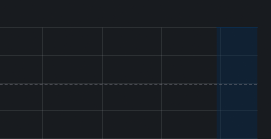

# 🖥️ homelab-infra

Repositório de infraestrutura do meu homelab pessoal, com monitoramento completo de servidor utilizando ferramentas open source da stack observabilidade.

---

## 📊 Dashboard



> Dashboard com métricas em tempo real: CPU, memória, disco, rede e uptime.

---

## 🛠️ Stack

| Ferramenta | Função |
|---|---|
| [Grafana](https://grafana.com/) | Visualização de métricas e dashboards |
| [Prometheus](https://prometheus.io/) | Coleta e armazenamento de métricas |
| [Node Exporter](https://github.com/prometheus/node_exporter) | Exportação de métricas do sistema operacional |

**Sistema operacional:** Ubuntu 24.04 LTS  
**Instalação:** Serviços nativos via `systemd` (sem Docker)

---

## 📁 Estrutura

```
homelab-infra/
+-- grafana/
¦   +-- dashboards/
¦       +-- node-exporter-full.json   # Dashboard exportado do Grafana
+-- assets/
¦   +-- dashboard.png                 # Print do dashboard
+-- README.md
```

---

## 🚀 Como reproduzir

### 1. Node Exporter

```bash
wget https://github.com/prometheus/node_exporter/releases/download/v1.8.2/node_exporter-1.8.2.linux-amd64.tar.gz
tar xvf node_exporter-1.8.2.linux-amd64.tar.gz
sudo cp node_exporter-1.8.2.linux-amd64/node_exporter /usr/local/bin/
sudo chmod +x /usr/local/bin/node_exporter
```

Crie o serviço em `/etc/systemd/system/node_exporter.service`:

```ini
[Unit]
Description=Node Exporter
After=network.target

[Service]
User=node_exporter
ExecStart=/usr/local/bin/node_exporter

[Install]
WantedBy=multi-user.target
```

```bash
sudo systemctl enable --now node_exporter
```

### 2. Prometheus

```bash
wget https://github.com/prometheus/prometheus/releases/download/v2.51.2/prometheus-2.51.2.linux-amd64.tar.gz
tar xvf prometheus-2.51.2.linux-amd64.tar.gz
sudo cp prometheus-2.51.2.linux-amd64/prometheus /usr/local/bin/
```

Configure `/etc/prometheus/prometheus.yml`:

```yaml
global:
  scrape_interval: 15s

scrape_configs:
  - job_name: 'node'
    static_configs:
      - targets: ['localhost:9100']
```

Crie o serviço em `/etc/systemd/system/prometheus.service`:

```ini
[Unit]
Description=Prometheus
After=network.target

[Service]
User=prometheus
ExecStart=/usr/local/bin/prometheus \
  --config.file=/etc/prometheus/prometheus.yml \
  --storage.tsdb.path=/var/lib/prometheus

[Install]
WantedBy=multi-user.target
```

```bash
sudo systemctl enable --now prometheus
```

### 3. Grafana

```bash
sudo apt install -y grafana
sudo systemctl enable --now grafana-server
```

Acesse `http://localhost:3000`, adicione o Prometheus como datasource e importe o dashboard `grafana/dashboards/node-exporter-full.json`.

---

## 📌 Sobre

Projeto desenvolvido como parte do meu homelab para praticar administração de sistemas Linux, monitoramento de infraestrutura e cultura DevOps/SRE.

**Áreas de interesse:** Sysadmin · Linux · Infraestrutura · Observabilidade
